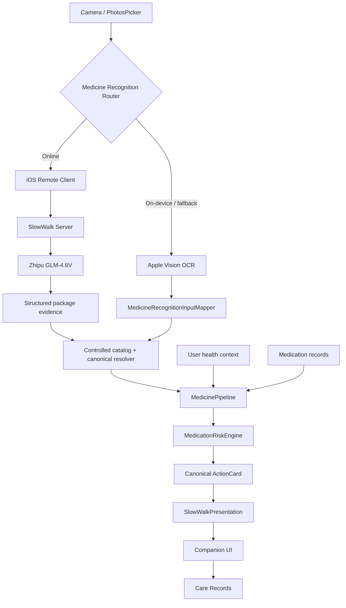

# 慢慢走 SlowWalk

> 面向银发族的 **用药安全与出行陪伴 iOS App**  
> 让技术减少长辈在关键节点上的错误操作，而不是要求长辈先学会使用复杂技术。

[](https://github.com/creaope/slow-walk/actions/workflows/swift-core.yml)
[](https://github.com/creaope/slow-walk/actions/workflows/swift-server.yml)
[](https://github.com/creaope/slow-walk/actions/workflows/ios-app.yml)


SlowWalk 最初面向高校移动应用创新赛构建，目前已经完成一版可运行、可真机演示的竞赛基线，并继续作为后续比赛与产品迭代项目维护。

当前主线聚焦两件事：

1. **用药安全**：从药品图片出发，完成在线多模态识别或本地 OCR、受控药品身份解析、个体化风险评估和行动卡片展示。
2. **出行陪伴**：用确定性演示路线串联锁屏实时活动、系统通知、语音与触觉提醒，验证适老化“低认知负担”交互方式。

> **重要说明**  
> SlowWalk 当前仍是竞赛与工程验证原型，不是医疗器械、诊断系统或真实导航产品。仓库中的药品、健康资料、演示路线与图片均包含合成/演示数据，并明确标注 `DEMO DATA — NOT FOR CLINICAL USE`。

---

## 为什么做 SlowWalk

很多银发类产品的问题并不是“功能太少”，而是：

- 信息密度过高，操作路径太长；
- 用药、出行、提醒、求助被拆成彼此无关的工具；
- AI 可以回答问题，却没有被放进真正需要它的交互节点；
- 安全产品很容易滑向“替老人做决定”或“让家属实时监控老人”。

SlowWalk 的设计目标是把复杂判断留在系统内部，把用户真正需要的内容压缩成：

> **现在该做什么 / 什么不要做 / 什么时候需要找人帮助**

因此项目优先追求：

- 少层级、大字号、原生 iOS 交互；
- 失败时保守处理，而不是“猜一个答案”；
- 风险结论可解释、可追溯；
- 在线能力增强体验，本地能力保证兜底；
- 高风险时才升级提醒，不把“守护”做成“监控”。

---

## 当前已经实现

### 1. 原生 iOS 应用骨架与适老化界面

当前 App 已形成三个顶层入口：

- **今天**：面向“现在需要做什么”的任务入口；
- **陪伴**：药品识别、风险结果与出行陪伴入口；
- **守护记录**：展示当前会话中产生的守护事件。

设置与个人入口收敛在“今天”页右上角，不再把大量工具平铺成首页菜单。

已经落地的 UI/UX 包括：

- SwiftUI 原生 `List` / `Form` / `Section` 等组件；
- 大字号与 Dynamic Type 基础；
- VoiceOver / Accessibility Label 基础；
- 中文竞赛演示文案；
- Demo 数据显式标记；
- 药品结果页、识别证据展示与安全说明；
- 相机/文档扫描和 PhotosPicker 图片入口。

---

### 2. 在线优先的药品图片识别主链路

当前竞赛基线已经接通：

```text
药品图片
   ↓
iOS Remote Medicine Recognition Client
   ↓
POST /api/v1/medicine/recognize
   ↓
SlowWalk Server
   ↓
智谱 GLM-4.6V
   ↓
受限包装视觉证据
   ↓
受控药品目录检索 + canonical resolver
   ↓
MedicinePipeline
   ↓
MedicationRiskEngine
   ↓
ActionCard / Presentation
```

在线识别的职责被刻意限制在“**读图、提取证据、提供候选线索**”。

它不能直接：

- 决定最终医学风险等级；
- 给出诊断；
- 生成剂量或服药频次；
- 判断“可以安全服用”；
- 绕过现有 canonical medicine resolver。

当前真机竞赛链路已经完成过：

```text
真实 iPhone
→ Debug App
→ 同一局域网内的 Mac SlowWalk Server
→ 智谱 GLM-4.6V
→ 受控目录 / canonical pipeline
→ 风险结果与 Presentation
```

的端到端验证。

这仍然是**受控演示目录下的在线包装识别**，不是通用药品识别或临床数据库。

---

### 3. Apple Vision 本地识别与离线兜底

当在线识别不可用，或用户选择“仅在设备上识别”时，App 使用：

```text
Apple Vision OCR
→ RecognizedTextObservation
→ MedicineRecognitionInputMapper
→ 本地受控药品目录
→ MedicinePipeline
```

当前路由策略遵循 fail-closed 原则：

- 网络离线、连接失败、超时、限流、明确的 Provider unavailable 可以进入本地 fallback；
- `ambiguous`、`noCandidate`、`unreadable`、协议错误、request-ID 不匹配、canonical / evidence 冲突等情况**不会**被本地模糊结果静默覆盖；
- 无法确认药品时，必须保留未确认状态并要求用户确认。

---

### 4. Canonical 用药安全管线

SlowWalk 不允许 App 页面、Server 或模型各自维护一套“药品真相”。

核心链路统一收敛到：

```text
识别证据
→ 药品候选解析
→ 用户确认（必要时）
→ 健康上下文
→ MedicinePipeline
→ MedicationRiskEngine
→ canonical ActionCard
→ Presentation
```

当前已具备：

- 绿 / 黄 / 橙 / 红四级风险体系；
- 药品解析歧义保护；
- 当前健康档案上下文；
- 近期用药记录输入；
- 风险原因与推荐动作；
- 展示前后的 requestID / generation / stale-result 防护；
- `careActionShown` 幂等记录语义；
- 受控的 Demo Medicine Catalog；
- 跨 iOS / Core / Server 的 canonical API contracts。

---

### 5. 本地用户资料基础

仓库已经包含本地用户资料的领域模型、校验、Repository 与运行时 Session 基础，支持：

- 称呼；
- 年龄；
- 过敏描述；
- 已诊断疾病；
- 当前使用药品名称；
- 本地保存、覆盖、重新读取和删除；
- schema version 与损坏数据保护。

普通用户输入的药名只保存为 `unresolvedMedicineNames`，不会被直接冒充成已经确认的 canonical ingredient ID。

当前竞赛默认组合仍使用 `BundledDemoUserProfile` 作为确定性演示资料，因此：

> **用户资料基础设施已经存在，但“真实用户资料贯穿全部运行时链路”仍属于后续开发项。**

---

### 6. 出行陪伴 Demo

当前仓库包含一条明确标记为：

```text
DEMO ROUTE — NOT REAL NAVIGATION
```

的确定性出行演示链路。

它用于验证适老化提醒体验，包括：

- travelling / approaching / attention-needed / arrived 等状态；
- 系统通知；
- AVSpeechSynthesizer 语音提醒；
- 触觉反馈；
- ActivityKit / Live Activity；
- stale session 与重复启动保护；
- 与陪伴页面的演示状态联动。

这条链路目前用于竞赛展示，不代表真实 GPS 导航已经完成。

---

## 当前能力矩阵

| 能力 | 当前状态 | 说明 |
| --- | --- | --- |
| 原生 SwiftUI App | ✅ | iOS 17+，正式 Xcode 工程与 Shared Scheme |
| 药品相机 / 相册采集 | ✅ | 文档扫描 + PhotosPicker |
| 智谱 GLM-4.6V 在线识别 | ✅ | 受控 Demo 目录，Server 持有凭据 |
| Apple Vision OCR | ✅ | 本地路径与在线故障兜底 |
| Canonical Medicine Pipeline | ✅ | 唯一药品身份与风险主链 |
| 四级风险 + ActionCard | ✅ | 确定性规则，不由 LLM 决策 |
| Today / Companion / Care Records | ✅ | 当前竞赛 UI 主结构 |
| 本地用户资料模型与存储 | ✅ | 当前 Demo 运行时仍默认使用合成资料 |
| 出行通知 / 语音 / 触觉 / Live Activity | ✅ Demo | 确定性演示路线，不是真实导航 |
| Care Records 持久化 | 🚧 | 当前竞赛组合以会话内记录为主 |
| 真实 CoreLocation 出行主链 | 🚧 | 后续比赛重点 |
| 真实权威药品数据库 / RAG | 🚧 | 当前仅受控 Demo 数据 |
| 生产级云部署与 TLS | 🚧 | 当前在线真机验证以 Debug LAN Server 为主 |
| 家属协同 | 🗺️ Roadmap | 仅在高风险事件下温和协同 |
| 实景视觉引路 | 🗺️ Roadmap | 未来扩展场景 |
| Share Extension 防诈 | 🗺️ Roadmap | 未来扩展场景 |

---

## 架构



### 在线识别的隐私边界

在线识别请求只发送：

- 规范化后的单张药品包装图片；
- MIME；
- request ID；
- API version；
- 非健康类客户端能力信息。

不会把以下内容发送到 Vision Provider：

- 用户健康档案；
- 过敏与疾病资料；
- 用药历史；
- 最终风险结果；
- Care Records。

Provider API Key 只允许存在于 SlowWalk Server 的运行环境中，不写入 iOS App、Info.plist、源码或仓库。

---

## 技术栈

### iOS

- Swift 6
- SwiftUI
- Observation
- async/await
- Vision / VisionKit
- AVFoundation
- PhotosUI
- SwiftData
- ActivityKit
- UserNotifications
- AVSpeechSynthesizer
- CoreLocation（核心与接口已存在，真实出行主链仍在推进）

### Core

- Swift Package Manager
- `SlowWalkDomain`
- `SlowWalkDataInterfaces`
- `SlowWalkRiskEngine`
- `SlowWalkMedicinePipeline`
- `SlowWalkMedicineKnowledge`
- `SlowWalkLocationRisk`
- `SlowWalkAPIContracts`
- `SlowWalkClientCore`

### Presentation

- `SlowWalkPresentation`
- canonical ActionCard → SwiftUI 展示状态映射
- Demo / safety notice 单一来源

### Server

- Swift 6
- Hummingbird 2
- URLSession
- Zhipu GLM-4.6V
- versioned API contracts
- structured logging
- credential / response redaction

---

## 仓库结构

```text
slow-walk/
├── ios/
│   ├── SlowWalkApp/                 # SwiftUI App
│   ├── SlowWalkAppTests/            # iOS tests
│   └── SlowWalkApp.xcodeproj/
├── swift-packages/
│   ├── SlowWalkCore/                # Domain / Pipeline / Risk / API contracts
│   └── SlowWalkPresentation/        # Canonical presentation layer
├── server/                           # Hummingbird Server + Zhipu Vision gateway
├── shared/
│   ├── fixtures/                    # Cross-layer fixtures
│   ├── api-examples/                # API request / response examples
│   └── demo-assets/                 # Deterministic synthetic demo assets
├── demo-fixtures/
├── docs/                             # Architecture / safety / ADR / runbooks
├── scripts/                          # Validation and demo-asset tooling
└── .github/workflows/                # Core / Server / iOS CI
```

进一步阅读：

- [`docs/ARCHITECTURE.md`](docs/ARCHITECTURE.md)
- [`docs/API_CONTRACT.md`](docs/API_CONTRACT.md)
- [`docs/MEDICINE_PIPELINE.md`](docs/MEDICINE_PIPELINE.md)
- [`server/README.md`](server/README.md)
- [`CONTRIBUTING.md`](CONTRIBUTING.md)

---

## 本地开发

### 环境要求

建议使用：

- macOS
- 支持 Swift 6 的 Xcode
- iOS 17+ Simulator / 真机
- Swift Package Manager

在线智谱识别是**可选能力**。没有 Provider 凭据时，Server 仍可运行，iOS 也可以使用设备内识别路径。

### 获取代码

```bash
git clone https://github.com/creaope/slow-walk.git
cd slow-walk
git switch develop
```

### Core

```bash
swift test --package-path swift-packages/SlowWalkCore
```

### Presentation

```bash
swift test --package-path swift-packages/SlowWalkPresentation
```

### Server

```bash
cd server
swift test
swift run SlowWalkServer
```

默认 Server 配置与在线识别环境变量说明见：

```text
server/.env.example
server/README.md
```

真实 API Key **不得提交到仓库**。

### iOS

使用 Xcode 打开：

```text
ios/SlowWalkApp.xcodeproj
```

也可以执行无签名 Simulator 构建：

```bash
xcodebuild \
  -project ios/SlowWalkApp.xcodeproj \
  -scheme SlowWalkApp \
  -configuration Debug \
  -destination 'generic/platform=iOS Simulator' \
  CODE_SIGNING_ALLOWED=NO \
  CODE_SIGNING_REQUIRED=NO \
  build
```

### Debug LAN 在线识别

iOS 在线识别使用非敏感配置项：

```text
SLOWWALK_MEDICINE_RECOGNITION_BASE_URL
```

Debug 构建允许连接受控私有局域网 HTTP 地址；Release 不应依赖该调试边界。

Server 端 Provider 凭据使用：

```text
ZHIPU_API_KEY
```

以及 `server/.env.example` 中列出的非敏感模型 / Base URL 配置。

---

## CI

当前仓库维护三条独立验证轨道：

- `Swift Core`
- `Swift Server`
- `iOS App`

工作流位于：

```text
.github/workflows/swift-core.yml
.github/workflows/swift-server.yml
.github/workflows/ios-app.yml
```

原则上：

> **没有真实构建 / 测试证据，就不把功能写成“已完成”。**

Apple 平台能力以 Xcode、Simulator 或真机验证为准；真实网络能力必须显式开启 smoke / E2E 门禁，普通单元测试不会偷偷访问外部 Provider。

---

## 医疗与安全边界

SlowWalk 的重点不是“让大模型判断能不能吃药”，而是建立一条可审计的安全链。

### 必须保持

- LLM / Vision Provider 不参与最终风险等级计算；
- canonical medicine identity 不能由页面或模型直接决定；
- 无可信来源支持时不生成剂量、频次、最大剂量、停药或治疗建议；
- 信息不足不能解释为“安全”；
- 识别失败时必须明确提示用户重新确认；
- ambiguous / protocol mismatch / evidence conflict 必须 fail closed；
- Demo Data 与真实医疗数据必须明确区分；
- 风险结果必须保留原因、证据与下一步动作；
- 健康资料不得为了药盒识别而上传给 Vision Provider。

### 当前数据边界

仓库中的：

- 药品目录；
- 健康档案；
- 药品图片；
- 出行路线；

主要用于自动测试与竞赛演示。

它们不代表真实临床知识库，也不应被用于真实诊疗决策。

---

## 下一阶段 Roadmap

当前仓库已经不再是“从零做一个比赛 Demo”的阶段。下一轮参赛开发更适合沿现有 canonical 架构继续扩展，而不是重新堆功能。

### P0：把竞赛 Demo 变成稳定产品骨架

- [ ] 让本地用户资料真正贯穿 Medicine runtime
- [ ] Care Records 持久化与生命周期管理
- [ ] 真机无障碍回归：VoiceOver、Dynamic Type、触控区域
- [ ] Production TLS / Server 部署配置
- [ ] TestFlight / 签名 / Release packaging

### P1：补齐真实出行主线

- [ ] CoreLocation 真机定位
- [ ] 真实 geofence / approaching / arrived
- [ ] 后台提醒边界
- [ ] Live Activity 与真实 outing session 对接
- [ ] 无网和低精度定位降级

### P1：升级药品知识能力

- [ ] 引入经过审核的真实药品权威来源
- [ ] provenance / freshness / source conflict 治理
- [ ] 受控检索或 RAG
- [ ] 将 Demo Catalog 与真实知识源明确隔离
- [ ] 建立可重复的真实来源合规测试集

### P2：扩展比赛叙事

- [ ] 高风险才触发的家属温和协同
- [ ] 地铁 / 高铁站实景视觉引路
- [ ] Share Extension 防诈与伪科普核查
- [ ] 更完整的“长辈独立出门的一天”端到端故事线

---

## 协作约定

默认分支为 `develop`。

开发时：

1. 从最新 `develop` 创建 `feature/*`、`fix/*`、`docs/*` 分支；
2. 一个 PR 保持一个核心目标；
3. 不在页面层复制 canonical DTO、风险枚举、状态机或 ActionCard 映射；
4. 不为了“顺手”跨越模块所有权；
5. 修改医学风险语义时必须单独审查；
6. 合并前记录真实测试与无法验证的范围。

不要直接在 `main` 或 `develop` 上开发。

详细规范见 [`CONTRIBUTING.md`](CONTRIBUTING.md)。

---

## 项目状态

SlowWalk 当前已经完成：

> **“可演示竞赛原型” → “具备可持续迭代架构的 iOS 项目”**

下一阶段的重点不是继续往 README 里堆“我们还想做十个 AI 功能”，而是把现有两条主线做得更真实、更稳定、更可验证，并在此基础上扩展下一轮比赛需要的场景。

**慢慢走，但每一步都算数。**
